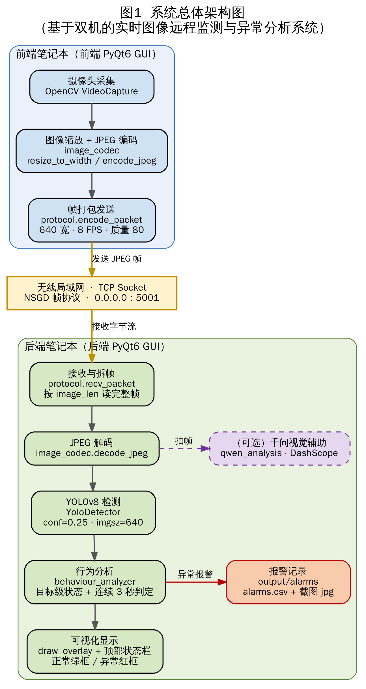
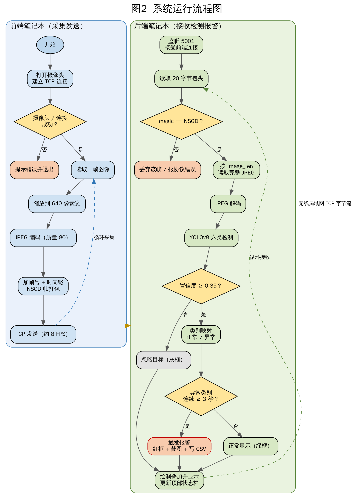
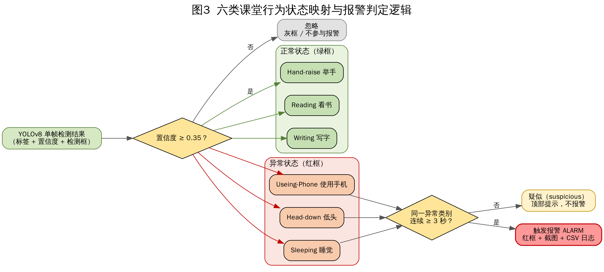

# 《网络系统综合设计》中期报告

**选题名称：基于双机的实时图像远程监测与异常分析系统（课堂行为检测）**

| 项目 | 内容 |
| --- | --- |
| 课程名称 | 网络系统综合设计（2025—2026 学年第 2 学期） |
| 设计题目 | 基于双机的实时图像远程监测与异常分析系统 |
| 异常分析场景 | 课堂学生行为（六类）实时检测与异常报警 |
| 小组人数 | 4 人 |
| 指导教师 | ____________ |
| 班级 | ____________ |
| 报告阶段 | 第 15 周阶段中期报告 |
| 报告日期 | 2026 年 6 月 ____ 日 |

---

## 一、选题与设计要求

### 1.1 选题定位

本小组从课程指导书的六类选题中选择第（6）类——**基于双机的实时图像远程监测与异常分析系统**。系统使用两台学生笔记本完成端到端的网络监控演示：

- **前端笔记本**配置摄像头，负责采集课堂图像；
- **后端笔记本**通过无线局域网接收图像流，调用 YOLO 目标检测模型分析画面内容；
- 当画面中出现持续的异常课堂行为（如睡觉、玩手机、长时间低头）时，系统触发报警，并在界面提示、保存截图与日志。

异常分析场景选定为**课堂学生行为检测**，把课堂行为划分为正常与异常两大类共六个具体类别，体现课程要求中的"网络远程传输"与"人工智能模型应用"两条主线。

### 1.2 设计要求对应

本选题对应课程指导书第 2.2 节"表 1 选题指南"中"基于图像的实时远程监测与异常分析"的基本要求，并完整覆盖以下要点：

1. 各小组选择不同的图像场景（本组选择课堂行为，如低头、睡觉、玩手机、举手、看书、写字等）；
2. 编程实现图像从前端传输到后端；
3. 后端编程处理图像；
4. 后端采用 YOLO 模型进行目标检测和行为分析；
5. 异常发现后报警，界面显示报警信息。

### 1.3 设计目标

1. 实现双机网络通信，使前端摄像头画面能够实时传输到后端；
2. 在后端完成图像解码、显示、检测与异常判定；
3. 使用 YOLOv8 模型识别课堂画面中的六类学生行为；
4. 针对课堂异常行为设计可解释的"目标级 + 连续时间"异常判定规则；
5. 在界面中显示实时画面、检测框、行为统计、报警信息与报警记录；
6. 形成可用于验收答辩的运行截图、测试数据、演示视频、设计报告与源程序。

---

## 二、小组组成与任务分工

为体现小组工作模式与团队协作精神，全组共 4 人，由组长负责联络、分工与进度协调，各成员分别承担网络传输、后端处理与模型应用等任务，并保留各自的代码与运行记录。

| 成员角色 | 姓名 | 班级/学号 | 主要任务 | 阶段完成情况 |
| --- | --- | --- | --- | --- |
| 组长 / 成员 1 | ____________ | ____________ | 总体架构、进度协调、报告整合、答辩组织；TCP 帧协议与公共模块（`protocol.py`、`image_codec.py`） | 已完成 |
| 成员 2 | ____________ | ____________ | 前端摄像头采集、图像缩放与 JPEG 编码、网络发送（`camera_client.py`、前端 GUI） | 已完成 |
| 成员 3 | ____________ | ____________ | 后端接收、图像解码与显示、网络状态统计、报警截图与 CSV 日志（`app.py`、后端 GUI） | 已完成 |
| 成员 4 | ____________ | ____________ | YOLOv8 模型集成、行为分析规则、报警逻辑、模型训练与离线测试（`detector.py`、`behaviour_analyzer.py`） | 已完成 |

> 说明：每名成员均保留个人完成内容的代码截图、运行截图与测试记录，用于填写阶段检查单、验收单与自评。

【此处建议插入：小组合影照片、分工讨论照片】

---

## 三、系统总体设计方案

> 对应阶段检查单课程目标 2：**具有网络远传与智能检测方案**。

### 3.1 总体架构

系统采用"**前端采集发送 + 后端接收分析 + 报警显示**"的双机架构。前端只负责采集、压缩与发送图像，保持逻辑简单；后端负责接收、显示、智能检测、异常判定与报警记录，便于集中展示课程要求中的"网络监控"与"智能模型应用"。

系统端到端的运行流程如图 2 所示：前端按帧率循环采集、缩放、压缩、打包并发送；后端按帧协议接收、解码、检测、目标级判定并在异常持续超阈值时报警。

### 3.2 网络传输协议设计

第一版采用 **TCP Socket** 传输。TCP 可靠性较高，便于说明网络协议、数据包结构与异常处理，也便于在报告中展示"协议知识描述"与"远程传输系统设计"。

为解决 TCP 的**粘包与拆包**问题，自定义了定长包头 + 变长图像数据的帧协议，由 `src/common/protocol.py` 实现：

| 字段 | 类型 / 长度 | 说明 |
| --- | --- | --- |
| magic | 4 字节（`NSGD`） | 固定帧标识，用于识别图像帧包、校验同步 |
| frame_id | 4 字节无符号整型 | 帧序号，用于报警去重与丢帧统计 |
| timestamp_ms | 8 字节无符号整型 | 前端采集时间戳（毫秒），用于计算端到端延迟 |
| image_len | 4 字节无符号整型 | JPEG 图像字节长度 |
| image_data | 变长 | JPEG 图像内容 |

- 包头总长 **20 字节**（结构格式 `!4sIQI`，网络字节序）；
- 后端先读取 20 字节包头，解析出 `image_len` 后，再按长度**完整读取** JPEG 数据，从根本上避免半帧、错帧；
- `recvall()` 循环接收直至读满指定字节数，保证在 TCP 字节流上正确还原一帧；
- 设置单帧最大 **10 MB** 上限与字段合法性校验，提升健壮性。

### 3.3 图像采集与编解码

由 `src/common/image_codec.py` 与 `src/frontend/camera_client.py` 实现：

- 前端使用 OpenCV 调用摄像头周期性读取视频帧；
- 通过 `resize_to_width()` 将图像统一缩放到 **640 像素宽**（等比缩放），降低网络传输压力；
- 通过 `encode_jpeg()` 进行 JPEG 压缩，默认质量 **80**；
- 按设定帧率（默认 **8 FPS**）发送图像，并附带帧序号与时间戳；
- 后端通过 `decode_jpeg()` 还原图像后进入检测流程。

### 3.4 智能检测与行为分析方案

后端调用 **YOLOv8** 目标检测模型识别课堂六类行为，并对每个检测目标独立判断状态。课堂行为类别映射如下：

| 模型标签 | 中文显示 | 状态 |
| --- | --- | --- |
| `Hand-raise` | 举手 | 正常 |
| `Reading` | 看书 | 正常 |
| `Writing` | 写字 | 正常 |
| `Useing-Phone` | 使用手机 | 异常 |
| `Head-down` | 低头 | 异常 |
| `Sleeping` | 睡觉 | 异常 |

异常判定采用"**目标级状态 + 类别级连续时间**"的可解释规则（`src/backend/behaviour_analyzer.py`）：

1. 单帧中，置信度低于 **0.35** 的目标被忽略，不参与判定与报警；
2. 每个检测框依据自身类别独立判断为正常或异常，并独立着色——**异常目标红框、正常目标绿框**、被忽略目标灰框；
3. 当某一异常类别**连续出现超过阈值（默认 3 秒）**时，触发帧级报警；
4. 报警状态只用于顶部状态栏提示、截图与日志，**不会把整帧所有目标统一标红**，正常目标仍保持绿色。

这一规则可解释性强：系统识别的是课堂监控画面中的"异常课堂行为"，而非医学意义上的睡眠状态，答辩时便于说明算法流程与误报控制。行为状态映射与报警判定逻辑如图 3 所示。

### 3.5 报警与日志

由 `src/backend/app.py` 实现：

- 顶部状态栏分三级显示：`normal` / `suspicious: N abnormal` / `ALARM: N abnormal - 类别摘要`；
- 报警发生时保存整帧标注截图到 `output/alarms/*.jpg`（图中仅异常目标为红框）；
- 报警记录追加写入 `output/alarms/alarms.csv`，字段包括：`frame_id`、`timestamp_ms`、`reason`、`duration_seconds`、`abnormal_count`、`abnormal_labels`、`image_path`；
- 报警按 `frame_id` 去重，避免同一帧重复写入。

---

## 四、计算环境与实验设备

> 对应阶段检查单课程目标 3：**合理的远程测试设备，有图像数据**。

### 4.1 软件计算环境

| 类别 | 选型 | 说明 |
| --- | --- | --- |
| 编程语言 | Python 3.12 | 不使用 3.14，避免 NumPy/OpenCV 二进制包不兼容 |
| 图像采集与处理 | OpenCV（opencv-python ≥ 4.9） | 摄像头调用、缩放、编解码、画框、截图 |
| 目标检测框架 | Ultralytics YOLOv8（≥ 8.2） | 课堂六类行为检测 |
| 数值计算 | NumPy（≥ 1.26） | 图像数组处理 |
| 图形界面 | PyQt6（≥ 6.6） | 前端发送 GUI 与后端监控 GUI |
| 网络传输 | Python 标准库 socket（TCP） | 自定义帧协议 |
| 辅助大模型（可选） | DashScope / 千问视觉（≥ 1.24.6） | 抽帧辅助分析 |
| 单元测试 | pytest（≥ 8.0） | 协议、编解码、检测、分析等模块测试 |

环境一键配置脚本：`scripts/setup_env.ps1`（自动寻找 Python 3.12 并将 pip 源设置为清华源）。

### 4.2 硬件与网络设备

| 设备 | 配置 | 作用 |
| --- | --- | --- |
| 前端笔记本 | 内置/外接摄像头 | 课堂图像采集与发送 |
| 后端笔记本 | 运行检测端 | 接收、检测、报警、记录 |
| 无线局域网 | 同一 WLAN | 两机互联，后端监听 `0.0.0.0:5001` |

默认运行参数：图像宽度 640 像素、发送帧率 8 FPS、JPEG 质量 80、报警阈值连续 3 秒、检测置信度阈值 0.25、检测输入尺寸 640。

### 4.3 图像数据

- **训练数据集**：`Student Behaviour Detection.v6i.yolov8`（课堂学生行为检测数据集，YOLOv8 格式）。规模为训练集 3192 张 / 118290 个标注框、验证集 581 张 / 27048 个框、测试集 292 张 / 11615 个框；
- **离线测试素材**：课堂行为样例图片与视频，用于在无第二台笔记本时完成单机闭环验证与模型效果展示；
- 后端 GUI 支持"选择图片测试 / 选择视频测试"，可直接载入本地素材展示 YOLO 识别框、行为计数与异常状态，便于验收快速演示。

---

## 五、阶段实践内容与编程进展（已完成工作）

> 对应阶段检查单课程目标 2、4：编程进展与设计内容表达。截至中期，系统已完成"双机图像传输 + 后端 YOLO 检测 + 目标级异常分析 + 报警截图与日志 + 双端 GUI"的完整闭环。

### 5.1 网络传输模块（已完成）

实现 `src/common/protocol.py`：定长包头 + 变长图像的 TCP 帧协议，包含 `encode_packet` / `parse_header` / `recvall` / `send_packet` / `recv_packet`，解决粘包拆包并支持端到端延迟统计。

### 5.2 图像编解码与前端采集发送（已完成）

- `src/common/image_codec.py`：`resize_to_width`、`encode_jpeg`、`decode_jpeg`；
- `src/frontend/camera_client.py`：命令行前端发送端，支持 `--host/--port/--camera/--width/--fps/--quality` 参数，按帧率稳定发送；
- `src/frontend/gui_client.py`：前端 PyQt6 GUI，可填写后端 IP、预览本地画面、显示发送指标。

【此处建议插入：前端 GUI 发送窗口运行截图】

### 5.3 后端接收与可视化（已完成）

- `src/backend/app.py`：命令行后端，完成监听、接收、解码、检测、异常分析、画面叠加、报警截图与 CSV 日志；
- `src/backend/gui_app.py`：后端 PyQt6 监控 GUI，实时显示检测画面、行为统计、报警状态，并支持本地图片/视频测试。

【此处建议插入：后端 GUI 监听窗口、六类检测框、目标级标红运行截图】

### 5.4 YOLOv8 检测器（已完成）

`src/backend/detector.py`：封装 Ultralytics YOLO，将模型输出统一转换为 `Detection`（标签、置信度、检测框）对象，检测器内不硬编码业务规则，默认置信度 0.25、输入尺寸 640。

### 5.5 行为分析与报警（已完成）

`src/backend/behaviour_analyzer.py`：实现六类行为的目标级状态判定与类别级连续时间报警，输出每个检测框的状态、原因与持续时间，以及整帧的报警状态摘要（异常数量、异常类别）。

### 5.6 双端 PyQt6 GUI（已完成）

前后端均提供 PyQt6 图形界面，适合答辩展示；同时保留命令行前后端作为备用与测试入口。提供 `START_FRONTEND_GUI.ps1`、`START_BACKEND_GUI.ps1` 一键启动脚本与后端打包脚本 `scripts/package_backend.ps1`。

### 5.7 千问视觉辅助分析（可选，已接入）

后端 GUI 同步接入阿里云 DashScope 千问视觉模型：在以 YOLO 实时检测与报警为主的前提下，按间隔抽取当前画面做辅助分析，在独立窗口显示紫色辅助框与文字概括。未配置 `DASHSCOPE_API_KEY` 时不影响 YOLO 检测、报警与记录的正常使用。

### 5.8 单元测试（已完成）

使用 pytest 覆盖协议、编解码、检测器、行为分析、后端应用、前后端 GUI、离线测试脚本等模块，共 14 个测试文件，保证核心逻辑可回归验证。

---

## 六、模型训练与测试数据分析

### 6.1 默认六类课堂行为模型

- 模型文件：`models/student_behaviour_v6_6cls_img960_e50_best.pt`（输入尺寸 960，训练 50 轮，6 类）；
- 类别：举手、看书、写字（正常）/ 使用手机、低头、睡觉（异常）；
- 离线测试（样例图片）：测试图片 3 张、预测记录 114 条，其中正常记录 66 条、异常记录 48 条，输出标注图片与 `predictions.csv`，证明六类模型能在本项目环境中正确加载并输出课堂行为类别。

### 6.2 自训练多状态模型（对照实验）

为对照不同模型能力，另基于 `Student Behaviour Detection.v6i.yolov8` 数据集训练了 12 类多状态模型（`yolov8n.pt`，20 轮，输入尺寸 640，训练耗时约 3.9 小时）。验证集整体指标：

| Precision | Recall | mAP50 | mAP50-95 |
| ---: | ---: | ---: | ---: |
| 0.739 | 0.685 | 0.709 | 0.466 |

代表性类别指标（节选）：

| 类别 | Precision | Recall | mAP50 |
| --- | ---: | ---: | ---: |
| upright（坐直） | 0.879 | 0.971 | 0.969 |
| sleep（睡觉） | 0.924 | 0.854 | 0.904 |
| bow_head（低头） | 0.870 | 0.927 | 0.930 |
| Using_phone（玩手机） | 0.747 | 0.602 | 0.644 |
| hand-raising（举手） | 0.482 | 0.526 | 0.511 |
| writing（写字） | 0.466 | 0.577 | 0.478 |

`test/images` 离线测试（292 张）共输出 12797 条预测，其中正常候选 7059 条、异常候选 5738 条。

**数据分析结论**：高频且姿态明显的类别（坐直、睡觉、低头）识别效果好；少样本或姿态相近的类别（举手、写字、转头）准确率偏低，存在"低头写字"与"趴桌睡觉"易混淆的难点。综合识别效果与稳定性，最终选用六类模型作为课程成果展示的默认模型。

### 6.3 待补充的实测数据

下列双机实测指标将在第 16 周联调阶段补全并填入报告：

| 指标 | 取值 | 说明 |
| --- | --- | --- |
| 平均接收帧率 | ______ FPS | 后端统计 |
| 平均端到端延迟 | ______ ms | `当前时间 − timestamp_ms` |
| 正常坐姿测试次数 | ______ | 应无报警 |
| 低头/写字测试次数 | ______ | 误报分析重点 |
| 趴桌睡觉测试次数 | ______ | 应触发报警 |
| 误报次数 / 漏报次数 | ______ / ______ | 准确性分析 |

---

## 七、阶段进度与完成情况

| 阶段任务 | 计划周次 | 状态 |
| --- | --- | --- |
| 需求分析与系统架构设计 | 第 15 周 | ✅ 已完成 |
| 课堂行为检测场景确定 | 第 15 周 | ✅ 已完成 |
| 双机 TCP 网络通信原型 | 第 15 周 | ✅ 已完成 |
| 前端摄像头采集与 JPEG 发送 | 第 15 周 | ✅ 已完成 |
| 后端图像接收、解码与显示 | 第 15 周 | ✅ 已完成 |
| YOLOv8 六类模型集成 | 第 15 周 | ✅ 已完成 |
| 目标级异常判定与报警记录 | 第 15 周 | ✅ 已完成 |
| 前后端 PyQt6 GUI | 第 15 周 | ✅ 已完成 |
| 模型训练与离线测试 | 第 15 周 | ✅ 已完成 |
| 双机现场联调与实测数据统计 | 第 16 周 | ⏳ 进行中 |
| 演示视频录制与报告定稿 | 第 16 周 | ⏳ 待完成 |
| 项目验收与答辩 | 第 16 周 | ⏳ 待完成 |

整体进度：系统核心功能已在第 15 周全部打通，进度符合预期，已具备验收所需的核心演示能力。

---

## 八、下一步实践计划（第 16 周）

1. 在同一无线局域网下完成两台笔记本的现场联调，统计平均帧率、端到端延迟与丢帧情况；
2. 按"正常坐姿、低头/写字、趴桌睡觉"三类场景采集测试样本，统计误报与漏报，重点分析"低头写字 ↔ 趴桌睡觉"的混淆；
3. 调优报警阈值（对比连续 1 秒 / 3 秒 / 5 秒效果），在实时性与误报控制间取得平衡；
4. 录制双机运行演示视频（含正常无报警片段与异常触发报警片段），上传云班课；
5. 整理运行截图、报警截图与 `alarms.csv` 记录，补全报告测试数据；
6. 完成设计报告定稿、源程序与数据打包，进行验收答辩准备。

---

## 九、存在的问题与解决思路

| 存在的问题 | 解决思路 |
| --- | --- |
| 自训练模型时间不足、少样本类别精度偏低 | 先以六类成熟模型 + 规则判定保证闭环；后续补充本校课堂数据继续训练 |
| 无线网络波动影响实时传输 | 降低分辨率与帧率，增加断线重连与丢帧处理 |
| "低头写字"与"趴桌睡觉"易混淆造成误报 | 采用连续时间阈值降低误报，并在报告中如实分析局限 |
| 当前按"类别级"连续时间判定，未做跨帧人员 ID 跟踪 | 第一版以类别级持续时间满足课程要求；如需"某学生连续异常"语义，后续加入目标跟踪 |
| 后端电脑性能不足导致检测卡顿 | 降低检测频率或输入尺寸；必要时抽帧检测 |
| 演示环境光照/角度变化影响检测 | 提前录制演示视频作为兜底，同时保留现场实时演示 |

---

## 十、阶段实践自评

> 评价按五级制：优秀、良好、中等、及格、不及格（优秀不超过 50%）。

| 学生姓名 | 自评等级 | 评价说明 |
| --- | --- | --- |
| （学生 1）____________ | ____________ | 负责总体架构与帧协议，闭环按期打通，承担报告整合 |
| （学生 2）____________ | ____________ | 完成前端采集发送与 GUI，发送稳定、参数可配 |
| （学生 3）____________ | ____________ | 完成后端接收、可视化与报警日志，记录完整 |
| （学生 4）____________ | ____________ | 完成模型集成、行为分析与离线测试，数据齐全 |

**小组总体进展自评**：阶段任务按计划完成，双机图像传输、智能检测与异常报警闭环已稳定运行，网络远传方案与智能检测方案清晰、可解释，图像数据与离线测试数据齐备，能够明确表达设计内容与进展。整体自评等级：____________。

---

## 参考文献

1. 张晓明. C# 网络通信程序设计（第 2 版）. 北京：清华大学出版社，2022.
2. 张晓明. 计算机网络设计与安全技术. 北京：中国铁道出版社，2025.
3. 王廷德. 基于深度学习的声场景分类和异常检测方法研究[D]. 北京石油化工学院硕士学位论文，2023.
4. 姜志鹏. 基于音频信号的机房设备状态分类算法设计与实现[D]. 北京石油化工学院本科学位论文，2022.
5. Ultralytics. YOLOv8 Documentation. https://docs.ultralytics.com.
6. 《网络系统综合设计》任务书和工作要求（V1.1）. 计算机科学技术系，2026.

---

*（注：报告中"____________"为待填写的人名/班级/数据项；"【此处建议插入……】"为待补充的照片或运行截图位置。）*
