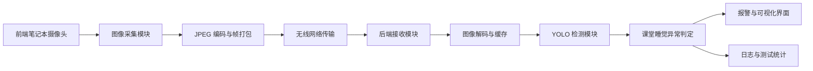

# 基于双机的实时图像远程监测与异常分析系统设计方案

日期：2026-06-08

## 1. 选题定位

本课程设计选题为“基于双机的实时图像远程监测与异常分析系统”，异常场景选择为课堂睡觉检测。系统使用两台学生笔记本完成端到端演示：前端笔记本通过摄像头采集课堂图像，后端笔记本通过无线网络接收图像流，调用 YOLO 等目标检测模型分析画面内容，并在发现疑似睡觉行为时触发报警和界面提示。

该方案对应课程指导书中“基于双机的实时图像远程监测与异常分析系统”要求，重点覆盖图像采集、网络远程传输、后端图像处理、智能模型检测、异常报警和报告展示。

## 2. 设计目标

1. 实现双机网络通信，使前端摄像头画面能够实时传输到后端。
2. 在后端完成图像解码、显示、检测和异常判定。
3. 使用 YOLO 模型识别课堂画面中的人、头部或疑似趴桌区域。
4. 针对课堂睡觉场景设计可解释的异常判定规则。
5. 在界面中显示实时画面、检测框、报警信息、报警时间和统计结果。
6. 形成可用于验收答辩的运行截图、测试数据、演示视频、设计报告和源程序。

## 3. 总体架构

系统采用“前端采集发送 + 后端接收分析 + 报警显示”的双机架构。

前端只负责采集、压缩和发送图像，保持逻辑简单。后端负责接收、显示、智能检测、异常判定和报警记录，便于集中展示课程要求中的“网络监控”和“智能模型应用”。

## 4. 功能模块设计

### 4.1 前端采集发送模块

前端笔记本连接摄像头，使用程序周期性读取视频帧。每帧图像被压缩为 JPEG 格式，并附带帧序号、时间戳和图像长度等元数据。前端通过无线局域网将数据发送到后端指定 IP 和端口。

前端主要功能包括：

- 摄像头初始化和画面采集。
- 图像尺寸调整，降低网络传输压力。
- JPEG 编码。
- 按设定帧率发送图像，例如 5-10 FPS。
- 网络断开时提示错误并尝试重新连接。

### 4.2 网络传输模块

推荐第一版使用 TCP Socket 传输。TCP 的可靠性较高，便于说明网络协议、数据包结构和异常处理，也便于在报告中展示“协议知识描述”和“远程传输系统设计”。

数据包结构建议如下：

| 字段 | 说明 |
| --- | --- |
| magic | 固定标识，用于识别图像帧包 |
| frame_id | 帧序号 |
| timestamp | 前端采集时间 |
| image_len | JPEG 图像字节长度 |
| image_data | JPEG 图像内容 |

后端按长度读取完整图像数据，避免 TCP 粘包、拆包导致的图像损坏。若后续需要网页界面或浏览器展示，可在 TCP 方案稳定后扩展为 WebSocket 或 HTTP MJPEG。

### 4.3 后端接收与显示模块

后端监听固定端口，接收前端发送的图像帧。收到完整帧后，后端解码 JPEG 图像并写入最新帧缓存。界面显示最新画面、网络状态、当前帧率、检测耗时和报警状态。

后端主要功能包括：

- 监听前端连接。
- 按数据包长度完整读取图像帧。
- 解码并显示实时图像。
- 统计接收帧率、延迟和丢帧情况。
- 网络异常时显示离线状态。

### 4.4 YOLO 检测模块

基础版本使用已有 YOLO 模型进行人体或头部相关目标检测。如果能获得或训练课堂睡觉数据，可进一步加入自定义类别，如 normal、sleep 或 desk_sleep。

推荐分两阶段实现：

1. 第一阶段使用通用 YOLO 模型检测 person，并结合画面区域和姿态规则判断疑似睡觉。
2. 第二阶段补充少量自采图片，若时间允许，标注并训练“正常听课”和“趴桌睡觉”类别，提高报告中的模型应用完整度。

检测输出包括目标类别、置信度、检测框坐标和检测耗时。后端将检测框绘制到实时画面中，并把检测结果传递给异常判定模块。

### 4.5 课堂睡觉异常判定模块

课堂睡觉不只依赖单帧检测结果，而是采用“多帧连续判定”的方式降低误报。基础规则如下：

1. 在画面中检测到人或头部区域。
2. 目标头部或上半身位置明显低于正常坐姿区域，或检测到趴桌形态。
3. 同一位置连续若干帧满足低头或趴桌条件。
4. 持续时间超过阈值，例如 3 秒，判定为疑似睡觉。

报警等级建议分为两类：

| 状态 | 条件 | 界面显示 |
| --- | --- | --- |
| 正常 | 未连续满足异常条件 | 绿色或普通状态 |
| 疑似睡觉 | 连续 3 秒满足异常条件 | 红色检测框、报警文字和报警记录 |

该规则的优点是可解释性强，适合答辩时说明算法流程和误报控制。报告中可以说明系统并不直接判断医学意义上的睡眠，而是识别课堂监控画面中的“疑似趴桌睡觉行为”。

### 4.6 报警与可视化模块

后端界面需要展示：

- 实时接收图像。
- YOLO 检测框和类别标签。
- 疑似睡觉区域高亮。
- 当前网络状态和接收帧率。
- 当前检测耗时。
- 报警时间、报警截图和报警次数。

报警方式采用界面文字提示和声音提示。报警记录保存到本地文件，便于最终报告展示测试结果。

## 5. 数据流与运行流程

1. 前端启动，输入后端 IP 和端口。
2. 前端打开摄像头，采集图像帧。
3. 前端压缩图像并按数据包格式发送。
4. 后端接收并解码图像。
5. 后端调用 YOLO 模型进行检测。
6. 后端根据检测结果和连续时间规则判断异常。
7. 若出现疑似睡觉，系统报警并保存记录。
8. 后端界面持续显示实时画面、检测结果和报警状态。

## 6. 技术选型

推荐技术栈如下：

| 模块 | 推荐技术 | 原因 |
| --- | --- | --- |
| 图像采集 | Python + OpenCV | 摄像头调用简单，适合快速实现 |
| 网络传输 | TCP Socket | 可靠、可解释，便于说明协议设计 |
| 模型检测 | YOLOv5/YOLOv8 | 资料丰富，适合目标检测课程展示 |
| 图像处理 | OpenCV | 便于画框、压缩、保存截图 |
| 后端界面 | PyQt/Tkinter/OpenCV 窗口 | 实现成本低，能满足验收展示 |
| 日志记录 | CSV/JSON | 便于统计报警次数、延迟和检测结果 |

优先保证完整闭环，第一版不引入复杂数据库和网页登录系统。若基本功能提前完成，再考虑 WebSocket 网页界面或自训练模型。

## 7. 实验与测试方案

### 7.1 网络传输测试

测试两台笔记本在同一无线局域网下的连接情况，记录后端 IP、端口、传输帧率、平均延迟和断线恢复情况。

### 7.2 图像采集测试

测试不同分辨率和帧率对传输效果的影响。建议先使用 640x480、5-10 FPS，保证后端检测稳定。

### 7.3 检测效果测试

采集三类测试画面：

- 正常坐姿听课。
- 低头看书或写字。
- 趴桌疑似睡觉。

统计每类画面的检测结果，记录正常、误报、漏报情况。重点分析低头写字和趴桌睡觉之间的混淆，这是本系统最主要的难点。

### 7.4 报警测试

测试连续阈值对报警效果的影响，例如连续 1 秒、3 秒、5 秒触发报警。最终建议选择 3 秒作为默认阈值，在实时性和误报控制之间取得平衡。

## 8. 异常处理设计

| 异常情况 | 处理方式 |
| --- | --- |
| 前端摄像头打开失败 | 前端提示错误并退出采集 |
| 后端未启动 | 前端连接失败并提示检查 IP 和端口 |
| 网络中断 | 后端界面显示离线，前端尝试重连 |
| 图像包不完整 | 丢弃当前帧，等待下一帧 |
| 模型加载失败 | 后端提示模型路径或依赖错误 |
| 检测耗时过长 | 降低分辨率或降低检测帧率 |

## 9. 阶段进度安排

### 第 15 周

- 完成需求分析和系统架构设计。
- 确定课堂睡觉检测场景。
- 完成双机网络通信原型。
- 完成前端摄像头采集和 JPEG 发送。
- 完成后端图像接收、解码和显示。
- 准备阶段检查单和第 1 周阶段实践小结材料。

### 第 16 周

- 集成 YOLO 检测模型。
- 完成课堂睡觉异常判定规则。
- 完成报警界面和报警记录。
- 完成双机联调和测试数据统计。
- 整理运行截图、演示视频、源程序和设计报告。
- 进行项目验收和答辩准备。

## 10. 小组分工建议

| 成员 | 主要任务 |
| --- | --- |
| 成员 1 | 组长，负责总体架构、进度协调、报告整合和答辩组织 |
| 成员 2 | 负责前端摄像头采集、图像编码和网络发送 |
| 成员 3 | 负责后端接收、图像显示、网络状态统计和日志保存 |
| 成员 4 | 负责 YOLO 模型集成、异常判定规则、报警界面和测试分析 |

每名成员都需要保留个人完成内容的代码截图、运行截图和测试记录，便于填写阶段检查单、验收单和自评。

## 11. 报告内容结构建议

最终设计报告建议包含：

1. 题目与设计要求。
2. 课题背景和文献查阅说明。
3. 系统总体架构图。
4. 系统功能框图。
5. 网络传输协议与数据包设计。
6. 图像采集与后端处理流程。
7. YOLO 检测模型和异常判定算法。
8. 主要程序模块和关键代码片段。
9. 运行界面截图和报警效果展示。
10. 系统测试结果，包括帧率、延迟、报警准确性和误报分析。
11. 小组任务分工和个人自评。
12. 存在问题与后续改进。
13. 参考文献。

## 12. 验收成功标准

验收时系统应至少完成以下演示：

1. 前端笔记本摄像头实时采集画面。
2. 后端笔记本通过无线网络接收并显示画面。
3. 后端能够运行 YOLO 检测并在画面上绘制检测结果。
4. 出现趴桌疑似睡觉动作时，系统能在连续判定后报警。
5. 界面能显示报警信息，并保存报警截图或日志。
6. 报告中能说明网络协议、系统架构、模型应用、实验数据和存在问题。

## 13. 主要风险与控制措施

| 风险 | 影响 | 控制措施 |
| --- | --- | --- |
| 自训练模型时间不足 | 影响识别效果 | 先使用通用 YOLO + 规则判断完成闭环 |
| 无线网络不稳定 | 影响实时传输 | 降低分辨率和帧率，增加重连机制 |
| 趴桌与低头写字混淆 | 造成误报 | 使用连续时间阈值，并在报告中分析局限 |
| 后端电脑性能不足 | 检测卡顿 | 降低检测频率，例如每 3 帧检测 1 帧 |
| 演示环境变化 | 影响检测结果 | 提前录制演示视频，同时保留现场实时演示 |

## 14. 推荐实施顺序

第一步先实现双机图像传输闭环，不接入模型。第二步在后端对接 YOLO，完成检测框显示。第三步加入课堂睡觉异常判定和报警记录。第四步整理测试数据、截图和报告。第五步在时间允许时尝试补充自采数据或优化检测规则。

该顺序能优先保证课程验收需要的核心功能，避免把时间过早消耗在模型训练或界面美化上。
