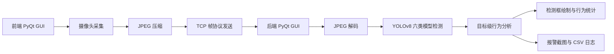

# YOLOv8 六类课堂行为模型与双机 PyQt GUI 融合设计

## 1. 背景

当前 `网络综合设计` 项目已经具备双机 TCP 图像传输、JPEG 编解码、后端 YOLO 检测、异常分析、报警截图和 CSV 日志能力。当前后端默认使用本项目训练得到的 12 类课堂行为模型。

`D:\Documents\YOLOv8` 项目提供了课堂行为识别模型 `yolov8_onnx/models/best_last.pt`，模型类别为 6 类：

| 类别序号 | 模型标签 | 中文含义 |
| ---: | --- | --- |
| 0 | `Hand-raise` | 举手 |
| 1 | `Reading` | 看书 |
| 2 | `Writing` | 写字 |
| 3 | `Useing-Phone` | 使用手机 |
| 4 | `Head-down` | 低头 |
| 5 | `Sleeping` | 睡觉 |

本次目标是在 `网络综合设计` 项目中复用现有双机协同思路，同时接入 `YOLOv8` 项目的 6 类识别模型和识别效果，并把前端和后端都改造成适合答辩展示的 PyQt6 图形界面。

## 2. 目标

1. 保留现有双机 TCP 通信协议和网络传输逻辑，继续体现课程中的双机协同要求。
2. 将 `YOLOv8` 项目的 6 类课堂行为模型复制到本项目内部，作为默认识别模型。
3. 新增前端 PyQt6 GUI，用于摄像头采集、连接后端、发送画面和展示发送指标。
4. 新增后端 PyQt6 GUI，用于监听前端连接、实时显示检测画面、展示行为统计、报警状态和日志。
5. 每个检测目标独立判断状态和颜色：异常目标标红，正常目标保持绿色。
6. 报警是帧级提示和日志事件，但报警发生时不能把整帧所有目标都标红。
7. 保留现有命令行前后端作为备用入口和测试入口。
8. 更新 README、离线测试证据和打包脚本，使课程验收能按步骤复现。

## 3. 非目标

本阶段不做人脸识别、学生身份识别、跨帧人员 ID 跟踪、数据库后台、网页登录系统或复杂权限管理。异常持续时间第一版仍按类别级持续时间计算，不尝试追踪同一个人的跨帧身份。

## 4. 推荐方案

采用“保留网络核心，新增双端 PyQt GUI”的方案。

现有 `src.common.protocol`、`src.common.image_codec`、`src.backend.detector` 和报警日志逻辑已经稳定，课程材料也围绕该架构展开。因此本次不重写网络协议，也不把 `YOLOv8` 单机界面整体搬入。新界面只作为更适合展示的入口，底层继续复用已有模块。

备选方案包括：

1. 整体搬入 `YOLOv8` 项目再补网络功能。该方案保留原界面更多，但网络传输、日志和验收证据需要重做，风险较高。
2. 从零重写一套 PyQt 双端程序。该方案结构最统一，但会浪费现有协议、测试和文档基础。

## 5. 总体架构

系统分为前端采集发送端和后端监控分析端。



前端只负责采集、预览、压缩和发送图像。后端负责接收、解码、检测、目标级异常分析、画面绘制、统计和报警记录。这种职责划分能清晰对应课程中的网络传输和智能分析两个部分。

## 6. 模型接入

模型从：

```text
D:\Documents\YOLOv8\yolov8_onnx\models\best_last.pt
```

复制到：

```text
D:\Documents\网络综合设计\models\classroom_behaviour_6cls.pt
```

本项目默认模型路径改为：

```text
models/classroom_behaviour_6cls.pt
```

这样后续运行和打包不依赖另一个项目目录。`YoloDetector` 继续负责把 Ultralytics 输出转换为统一 `Detection` 对象，不在检测器内硬编码业务规则。

## 7. 行为规则

6 类模型的状态划分为：

| 模型标签 | 中文显示 | 状态 |
| --- | --- | --- |
| `Hand-raise` | 举手 | 正常 |
| `Reading` | 看书 | 正常 |
| `Writing` | 写字 | 正常 |
| `Useing-Phone` | 使用手机 | 异常 |
| `Head-down` | 低头 | 异常 |
| `Sleeping` | 睡觉 | 异常 |

后端保留大小写不敏感匹配，避免模型标签大小写变化导致规则失效。中文显示只用于界面和文档，不影响内部协议。

异常类别连续出现超过 `alarm_seconds`，默认 3 秒，触发报警。报警状态用于顶部提示、日志和截图，不用于覆盖每个目标的独立颜色。

## 8. 目标级标红规则

检测框颜色必须由当前检测目标自己的状态决定：

- 异常目标：红色。
- 正常目标：绿色。
- 低置信度目标：灰色或不参与报警。
- 未知类别：黄色或灰色，显示为 unknown，不触发报警。

同一帧中如果同时存在 `Sleeping` 和 `Writing`，只有 `Sleeping` 目标显示红框，`Writing` 目标仍显示绿框。即使顶部状态显示报警，正常目标也不能被统一改为红色。

CSV 报警记录保存异常类别、异常目标数量、持续时间和截图路径。报警截图保存整帧画面，但图中只有异常目标为红框。

## 9. 前端 GUI

新增文件：

```text
src/frontend/gui_client.py
START_FRONTEND_GUI.ps1
```

前端窗口功能：

1. 输入后端 IP 和端口。
2. 输入摄像头编号。
3. 开始发送和停止发送。
4. 显示本地摄像头预览。
5. 显示连接状态：未连接、连接中、已连接、断开。
6. 显示发送 FPS、分辨率、已发送帧数、最近一帧 JPEG 大小。
7. 发送过程使用独立线程，避免界面卡顿。
8. 关闭窗口时释放摄像头、关闭 socket 并停止线程。

前端 GUI 仍调用现有 `resize_to_width`、`encode_jpeg` 和 `send_packet`，不复制协议代码。

## 10. 后端 GUI

新增文件：

```text
src/backend/gui_app.py
START_BACKEND_GUI.ps1
```

后端窗口功能：

1. 输入监听地址、端口、模型路径和报警阈值。
2. 启动监听和停止监听。
3. 显示来自前端的实时画面和 YOLO 检测框。
4. 显示行为统计：举手、看书、写字、使用手机、低头、睡觉。
5. 显示报警状态：正常、可疑、报警。
6. 显示异常类别、异常目标数量、异常持续时间。
7. 显示网络状态：监听地址、前端地址、接收 FPS、检测耗时、网络延迟。
8. 显示最近报警日志。
9. 报警时继续写入 `output/alarms/alarms.csv` 并保存截图。
10. 接收和检测过程使用后台线程，GUI 只负责渲染最新结果。

后端 GUI 复用现有 `recv_packet`、`decode_jpeg`、`YoloDetector`、`BehaviourAnalyzer`、`draw_overlay` 和 `append_alarm` 中可复用的逻辑。若 `draw_overlay` 需要中文显示，可拆出绘制函数，但不改变检测和报警语义。

## 11. 文件结构

新增或调整后的关键文件如下：

```text
models/
  classroom_behaviour_6cls.pt
src/
  backend/
    app.py
    behaviour_analyzer.py
    detector.py
    gui_app.py
  frontend/
    camera_client.py
    gui_client.py
tests/
  test_behaviour_analyzer.py
  test_backend_app.py
  test_gui_defaults.py
docs/
  course-evidence/
    yolov8-6cls-offline-test.md
START_BACKEND_GUI.ps1
START_FRONTEND_GUI.ps1
```

命令行入口继续保留：

```powershell
.\.venv\Scripts\python.exe -m src.backend.app
.\.venv\Scripts\python.exe -m src.frontend.camera_client --host <后端 IP>
```

GUI 入口新增：

```powershell
.\START_BACKEND_GUI.ps1
.\START_FRONTEND_GUI.ps1
```

## 12. 数据流

1. 前端 GUI 打开摄像头。
2. 前端按指定宽度缩放画面，并压缩为 JPEG。
3. 前端通过 TCP 发送 `frame_id + timestamp + image_len + image_bytes`。
4. 后端 GUI 接收完整帧包，并解码 JPEG。
5. 后端调用 6 类 YOLO 模型进行检测。
6. 检测器输出统一 `Detection` 列表。
7. 行为分析器输出每个目标的 `DetectionAssessment` 和帧级 `AlarmState`。
8. 后端绘制检测框、更新统计、更新日志。
9. 达到报警阈值时保存截图和 CSV 记录。

## 13. 错误处理

前端错误处理：

- 摄像头无法打开时在界面显示错误，不崩溃。
- 后端连接失败时显示失败原因，允许重新连接。
- 发送过程中断线时停止发送并释放资源。

后端错误处理：

- 模型文件不存在时显示路径错误。
- 端口被占用时显示监听失败。
- 前端断开后回到等待连接状态。
- 单帧 JPEG 解码失败时跳过该帧并记录状态。
- 检测耗时过长时界面继续显示上一帧状态，不阻塞窗口响应。

## 14. 测试设计

单元测试覆盖：

1. 6 类模型标签映射到正常或异常状态。
2. 异常连续超过阈值后触发报警。
3. 异常目标和正常目标在同一帧中独立着色。
4. 默认模型路径为 `models/classroom_behaviour_6cls.pt`。
5. GUI 默认参数和启动脚本路径不偏离 README。
6. 现有协议、图像编解码、检测器转换测试继续通过。

离线测试覆盖：

使用 `D:\Documents\YOLOv8\yolov8_onnx\测试` 中的图片或抽帧图片运行 6 类模型推理，输出：

```text
output/offline_test/yolov8-6cls/
  predictions.csv
  *.jpg
```

课程报告可以引用离线测试图、预测 CSV、双机运行截图和报警记录。

## 15. README 与课程材料

README 需要更新为以 GUI 演示为主：

1. 安装环境。
2. 后端 GUI 启动。
3. 前端 GUI 启动。
4. 双机连接步骤。
5. 六类课堂行为含义。
6. 目标级异常报警说明。
7. 离线测试命令。
8. 打包命令。
9. 答辩说明要点。

`docs/course-evidence/checklist.md` 需要同步更新，新增前端 GUI、后端 GUI、6 类模型和目标级标红截图要求。

## 16. 打包设计

后端包默认包含：

```text
models/classroom_behaviour_6cls.pt
src/backend/
src/common/
requirements.txt
START_BACKEND_GUI.ps1
START_BACKEND.ps1
```

前端包可以先不单独打包，因为前端只依赖摄像头、OpenCV、PyQt6 和公共协议模块。若需要独立交付，可再增加 `package_frontend.ps1`。

## 17. 验收标准

1. 前端 GUI 可以打开摄像头并连接后端。
2. 前端 GUI 可以显示本地预览、发送 FPS、分辨率和已发送帧数。
3. 后端 GUI 可以监听端口并显示前端画面。
4. 后端 GUI 可以加载 6 类课堂行为模型。
5. 后端可以绘制 6 类模型检测框和中文统计。
6. 同一帧中正常目标和异常目标颜色互不影响。
7. 异常持续超过 3 秒后触发报警。
8. 报警时只给异常目标标红，正常目标保持绿色。
9. `output/alarms/alarms.csv` 和报警截图正常生成。
10. 离线测试能生成预测 CSV 和标注图。
11. README 中的双机 GUI 启动步骤能被复现。
12. 原有自动化测试和新增测试通过。

## 18. 实施顺序

1. 复制 6 类模型到本项目 `models/`。
2. 修改行为分析规则和默认模型路径。
3. 增加目标级颜色相关测试。
4. 新增前端 GUI。
5. 新增后端 GUI。
6. 增加启动脚本。
7. 增加离线测试记录。
8. 更新 README 和验收清单。
9. 更新后端打包脚本。
10. 运行测试和双机或单机回环验证。
