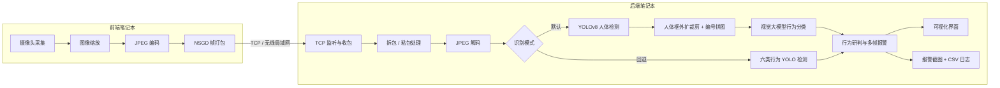
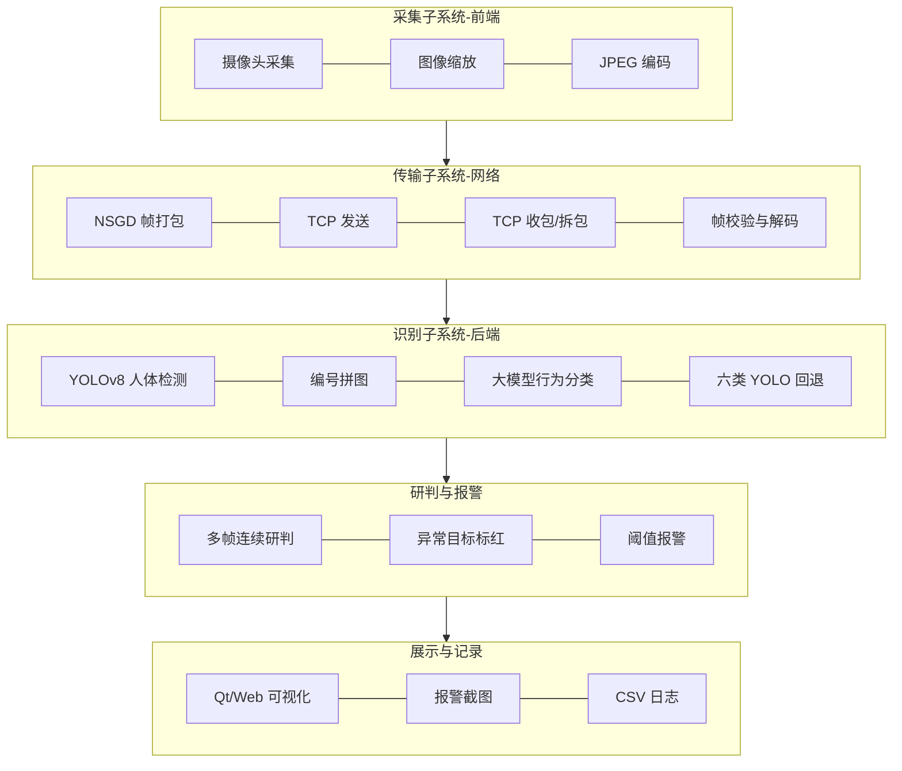
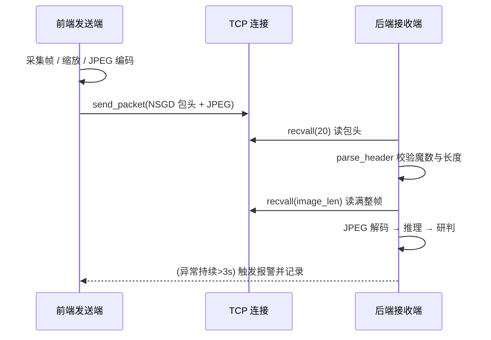
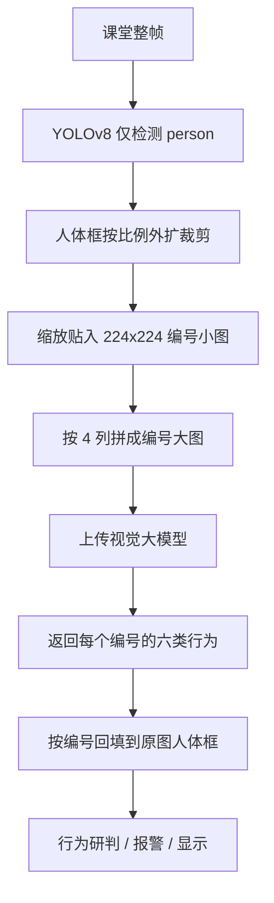

# 《网络系统综合设计》项目报告

## 基于双机协同的实时图像远程监测与课堂行为分析系统

### —— 融合自定义 TCP 传输、YOLOv8 人体检测与视觉大模型行为分类的两阶段方案

---

> **填写说明（提交前请替换以下占位信息，并删除本提示块）**
>
> | 项目 | 内容 |
> | --- | --- |
> | 学校 / 系 | 【请填写】计算机科学技术系 |
> | 专业 / 班级 | 计算机科学与技术 / 计 23【X】班 |
> | 课程名称 | 网络系统综合设计（2 周 2 学分） |
> | 学期 | 2025—2026 学年第 2 学期（第 15—16 周） |
> | 选题类型 | 第（6）类：基于双机的实时图像远程监测与异常分析系统 |
> | 设计题目 | 基于双机的实时图像远程监测与异常分析系统（课堂行为场景） |
> | 小组组长 | 【姓名 / 学号】 |
> | 小组成员 | 【成员 2 姓名 / 学号】、【成员 3 姓名 / 学号】、【成员 4 姓名 / 学号】 |
> | 指导教师 | 【请填写：张晓明 / 崔宁 / 卓政 / 张莉 / 吴永豪 之一】 |
> | 完成日期 | 2026 年 6 月 |
> | 代码仓库 | XaneheCode/YOLOv8-ClassBehave |
>
> *注：任务书《网络系统综合设计》V1.1（2026-06-05，课程负责人张晓明）列出 6 类选题，本组对应第（6）类"基于双机的实时图像远程监测与异常分析系统"，每组 4 人，图像场景自选，本组选定"课堂行为（含睡觉、玩手机、低头等）"。*

---

## 摘要

本项目面向课堂教学场景，设计并实现了一套**基于双机协同的实时图像远程监测与课堂行为分析系统**。系统由前端采集笔记本与后端分析笔记本组成：前端通过摄像头采集课堂画面，经 JPEG 压缩后以自定义 **`NSGD` TCP 帧协议**经无线局域网传输至后端；后端完成收包、解码、智能识别、行为研判与异常报警，并保存截图与 CSV 日志，形成完整的"采集—传输—分析—报警—记录"闭环。

在智能识别方案上，项目经历了三次迭代，最终形成**两阶段识别架构**：第一阶段由 YOLOv8 仅负责高鲁棒性的**人体检测**，第二阶段将检出的人体框外扩裁剪、编号拼接成大图后交由**视觉大模型（GPT-5.5 / 通义千问 Qwen-VL）**完成六类课堂行为分类，并通过多模型融合策略提升手机使用等易混类别的判别能力。系统同时保留训练好的六类行为 YOLO 权重作为回退方案。

实验结果表明：自定义 TCP 协议在 640 像素宽、8 FPS 条件下可稳定传输并正确处理粘包/拆包；人体检测经现场数据微调后，独立现场照片的人体检出数由 197 提升至 285（mAP50 由 0.931 提升至 0.954）；在 84 个人工复核目标上，多模型融合的展示口径严格准确率达 **63.10%**，优于单独 GPT 的 58.33% 与千问的 50.00%。系统提供 Qt 双端 GUI 与浏览器 Web 控制台两套演示界面，自动化测试全部通过，可满足课程验收与答辩展示要求。

**关键词**：网络综合设计；双机协同；TCP 自定义协议；YOLOv8；视觉大模型；课堂行为分析；异常检测

---

## 目录

1. 绪论
2. 需求分析与总体方案
3. 系统总体架构设计
4. 网络传输协议设计
5. 核心功能模块设计与实现
6. 智能模型应用与训练
7. 实验方案设计与测试结果
8. 创新特色与技术前沿
9. 存在问题与改进方向
10. 小组分工与个人贡献
11. 结论
12. 参考文献
13. 附录

---

## 一、绪论

### 1.1 课题背景与意义

课堂是教学活动的核心场所，学生的课堂状态（专注听讲、举手互动、阅读书写、低头玩手机、趴桌睡觉等）是评价课堂质量的重要依据。传统的人工巡查方式存在覆盖面有限、主观性强、无法量化记录等问题。随着计算机视觉与深度学习的发展，利用摄像头对课堂画面进行自动化、智能化分析成为可能。

本课题以《网络系统综合设计》课程为依托，选题为指导书中的"**基于双机的实时图像远程监测与异常分析系统**"，并将异常分析场景具体化为"课堂行为识别与异常预警"。课题同时覆盖课程要求的多个核心知识点：

- **图像采集**：摄像头视频流的实时获取与编码；
- **网络远程传输**：自定义协议、数据包结构与可靠传输设计；
- **后端图像处理**：解码、缓存、可视化；
- **智能模型应用**：目标检测与视觉大模型推理；
- **异常报警与日志**：可解释的多帧研判规则与证据留存。

因此，本课题既是一次完整的网络系统工程实践，也是一次智能视觉算法的综合应用，具有较强的工程性、综合性与前沿性。

### 1.2 国内外研究与文献调研现状

在课堂行为识别方向，已有大量公开数据集与模型工作：

- **SCB-Dataset 系列**（Student Classroom Behavior）是面向课堂行为检测的代表性数据集，SCB-Dataset5 记录约 **7,428 张图片、106,830 个标注**，覆盖举手、读书、写字、低头、趴桌、玩手机等约 20 类课堂对象/行为，与本系统目标高度吻合；
- **Roboflow Universe** 上的课堂行为数据集（约 14.2k 张图片）进一步补充了 `sleep`、`bow_head`、`Using_phone`、`writing` 等类别；
- **CrowdHuman** 是面向密集人群的人体检测数据集，常用于提升遮挡、密集场景下的人体框召回；
- 在目标检测算法上，**YOLO 系列**（YOLOv5/YOLOv8）凭借实时性与易用性成为课堂行为检测的主流选择；
- 在多模态方向，**视觉大模型**（如通义千问 Qwen-VL、GPT 系列视觉接口）具备零样本/少样本的语义理解能力，为细粒度、边界模糊的行为分类提供了新思路。

调研同时发现一个关键问题：**单一数据集训练的六类行为 YOLO 容易对特定教室、拍摄角度和标注风格过拟合**，在远景、多目标、遮挡的真实课堂中漏检明显，且"低头写字 / 看书 / 玩手机"等行为在视觉上高度重叠，纯检测模型难以稳定区分。这一发现直接驱动了本项目从"单模型检测"向"人体检测 + 大模型分类"两阶段方案的演进。

### 1.3 设计任务与要求

依据《网络系统综合设计》任务书 V1.1，本组选题为第（6）类"**基于双机的实时图像远程监测与异常分析系统**"，任务书对该选题的设计基本要求为：

> 各小组选择不同的图像场景（如课堂睡觉、拥挤、打架、上课、登高等行为）；编程实现图像传输到后端；后端编程处理图像；后端采用 YOLO 模型等进行目标检测和行为分析；异常发现后报警，界面显示报警信息。

据此，本设计需完成：

1. 实现双机网络通信，使前端摄像头画面实时传输到后端（图像传输）；
2. 在后端完成图像解码、显示与处理（后端图像处理）；
3. 使用 YOLO 等目标检测/智能模型识别课堂画面中的人与行为（目标检测与行为分析）；
4. 设计可解释的异常判定规则与多帧报警机制（异常报警）；
5. 在界面中展示实时画面、检测框、报警信息、时间与统计结果（界面报警显示）；
6. 形成可用于验收答辩的运行截图、测试数据、源程序与设计报告。

本设计与课程四项教学目标的对应关系如下，本报告（设计报告，占总成绩 35%）重点支撑目标 1、2、4：

| 课程教学目标 | 内涵 | 本设计的支撑 | 设计报告分值 |
| --- | --- | --- | ---: |
| 目标 1 | 深化网络原理理解，用于协议分析与应用设计 | 第四章 `NSGD` 协议设计、第三章总体架构 | 14% |
| 目标 2 | 构造网络协议包，增强协议/算法实现与创新 | 第四章帧编解码、第五章算法、第八章创新 | 14% |
| 目标 3 | 网络采集/仿真构造数据并实现数据处理 | 第六章数据集与训练、第七章实验数据处理 | （主要由阶段检查与验收答辩考核） |
| 目标 4 | 表达设计方案、通过答辩、形成报告 | 本报告整体结构、图表、分工与自评 | 7% |

### 1.4 本文主要工作

- 设计并实现了自定义 **`NSGD` TCP 帧协议**，完整覆盖魔数、帧序号、时间戳、长度字段与粘包/拆包处理；
- 构建了"前端采集发送 + 后端接收分析 + 报警记录"的双机软件体系；
- 提出并落地"**YOLOv8 人体检测 + 视觉大模型行为分类**"的两阶段识别架构，并设计了人体裁剪编号拼图算法与多模型融合策略；
- 完成了数据集调研、六类行为 YOLO 训练、人体检测现场微调与大模型分类准确率评测等系列实验；
- 实现了 Qt 双端 GUI 与浏览器 Web 控制台两套演示界面，并建立了完整的自动化测试与证据归档体系。

为便于对照，下表给出任务书第 5.4 条要求的报告内容与本报告章节的对应关系：

| 任务书要求内容 | 本报告对应章节 |
| --- | --- |
| ① 题目与设计要求 | 1.3 设计任务与要求 |
| ② 课题文献查阅说明 | 1.2 国内外研究与文献调研现状 |
| ③ 系统架构图 | 3.2 总体数据流（架构图） |
| ④ 系统功能框图 | 3.3 系统功能框图 |
| ⑤ 设计流程图 | 4.4 发送/接收流程、5.5 两阶段流程图 |
| ⑥ 算法描述 | 5.4 行为研判、5.6 编号拼图、5.7 融合策略 |
| ⑦ 运行界面截图 | 5.9 运行界面与截图说明 |
| ⑧ 设计要点和主要程序片断 | 第四、五章关键代码片段 |
| ⑨ 系统运行与调试结果 | 第七章 实验方案设计与测试结果 |
| ⑩ 小组任务分工说明和自评 | 第十章 小组分工与个人贡献 |
| ⑪ 存在的问题与今后的解决思路 | 第九章 存在问题与改进方向 |
| ⑫ 参考文献 | 第十二章 参考文献 |

---

## 二、需求分析与总体方案

### 2.1 功能需求

| 编号 | 功能 | 说明 |
| --- | --- | --- |
| F1 | 图像采集 | 前端调用摄像头按设定分辨率与帧率采集画面 |
| F2 | 图像传输 | 通过自定义 TCP 协议在无线局域网内可靠传输 JPEG 帧 |
| F3 | 图像接收与显示 | 后端解码并实时显示画面、网络状态、帧率 |
| F4 | 目标/行为识别 | 检测人体并分类六类课堂行为 |
| F5 | 异常研判 | 对异常行为进行多帧连续判定 |
| F6 | 报警与记录 | 触发报警提示，仅对异常目标标红，保存截图与 CSV |
| F7 | 本地演示 | 支持图片/视频本地素材测试，便于验收快速展示 |
| F8 | 大模型可配置 | 运行时切换 GPT-5.5 / 千问，并可调整大模型目标上限 |

### 2.2 非功能需求

- **实时性**：在 640 像素宽、5—10 FPS 下保证可用的端到端时延；
- **可靠性**：TCP 可靠传输，正确处理粘包/拆包、断线与异常帧；
- **可解释性**：异常判定采用阈值化的多帧规则，便于答辩说明；
- **可扩展性**：识别后端支持双模式切换与多种大模型接口；
- **可演示性**：同时提供正式双机链路与单机 Web 链路。

### 2.3 设备与运行环境

| 类别 | 配置 |
| --- | --- |
| 前端笔记本 | 内置/外接摄像头，连接无线局域网 |
| 后端笔记本 | 安装依赖，运行检测端（建议带 GPU 更佳） |
| 网络 | 两台笔记本位于同一无线局域网 |
| 语言/运行时 | Python 3.12（避免使用 3.14，防止 NumPy/OpenCV 二进制不兼容） |
| 关键依赖 | OpenCV、Ultralytics(YOLOv8)、PyQt6、NumPy、requests、dashscope |
| 云端训练 | NVIDIA RTX 3060 12GB、PyTorch 2.5.1+cu124、CUDA 12.4、Ultralytics 8.3.230 |

### 2.4 总体技术方案：两条演示链路

为兼顾"网络设计特色"与"现代化展示"，系统提供两条互补的演示链路：

1. **正式双机链路（网络设计核心）**：Qt 前端发送端 → 自定义 `NSGD` TCP 帧包 → Qt 后端分析端。完整保留包头、帧编号、时间戳、长度字段、粘包处理与收发线程，是课程网络设计的主线。
2. **单机展示链路（快速演示）**：浏览器 Web 控制台，通过本地 HTTP API（`/api/yolo-frame`、`/api/vlm-frame`）调用同一套 YOLO 与大模型分析逻辑，适合图片、视频、摄像头的快速演示与前端界面展示，无需 Node.js。

---

## 三、系统总体架构设计

### 3.1 体系结构

系统采用"**前端采集发送 + 后端接收分析 + 报警显示**"的双机分层架构。前端逻辑保持轻量（仅采集、压缩、发送），后端集中承载网络接收、智能分析、异常研判与记录，从而把课程要求的"网络监控"与"智能模型应用"集中呈现。

### 3.2 总体数据流（架构图）



### 3.3 系统功能框图

系统按"采集—传输—处理—识别—研判—展示/记录"组织功能，功能框图如下：



### 3.4 软件模块划分

| 层次 | 模块 | 源文件 |
| --- | --- | --- |
| 公共层 | TCP 帧协议 | `src/common/protocol.py` |
| 公共层 | 图像编解码 | `src/common/image_codec.py` |
| 公共层 | 数据类型定义 | `src/common/types.py` |
| 公共层 | Qt 仪表盘主题 | `src/common/qt_dashboard_theme.py` |
| 前端 | 命令行发送端 | `src/frontend/camera_client.py` |
| 前端 | Qt 发送端 GUI | `src/frontend/gui_client.py` |
| 后端 | 命令行后端 | `src/backend/app.py` |
| 后端 | Qt 后端 GUI | `src/backend/gui_app.py` |
| 后端 | YOLO 检测适配器 | `src/backend/detector.py` |
| 后端 | 行为分析与报警 | `src/backend/behaviour_analyzer.py` |
| 后端 | 人体裁剪编号拼图 | `src/backend/person_crop_grid.py` |
| 后端 | 大模型分析 | `src/backend/qwen_analysis.py` |
| Web | 本地 HTTP 服务 | `src/web/server.py` |
| Web | 前端控制台 | `web-dashboard/` |

---

## 四、网络传输协议设计

> 本章是本课程设计的网络核心，对应评分中"网络协议知识描述"与"远程传输系统设计"。

### 4.1 传输层选型（TCP vs UDP）

课堂图像帧体积较大且要求完整可解码，因此第一版选择 **TCP Socket**。相较 UDP，TCP 的优点是：

- **可靠有序**：保证每一帧 JPEG 完整、有序到达，避免花屏；
- **便于讲解**：可清晰展示协议设计、数据包结构与异常处理；
- **粘包可控**：通过"定长包头 + 变长负载"的应用层协议彻底解决 TCP 字节流的粘包/拆包。

代价是实时性略低于 UDP，但在课堂监控这种"准实时"场景下完全可接受。

### 4.2 NSGD 自定义帧协议

系统定义了名为 **`NSGD`** 的应用层帧协议，采用"固定 20 字节包头 + 变长 JPEG 负载"结构。包头使用网络字节序（大端）打包，格式为 `!4sIQI`：

| 字段 | 类型 | 长度 | 说明 |
| --- | --- | --- | --- |
| `magic` | `4s` | 4 B | 固定魔数 `NSGD`，用于帧同步与合法性校验 |
| `frame_id` | `I`(uint32) | 4 B | 帧序号，用于统计丢帧与排序 |
| `timestamp_ms` | `Q`(uint64) | 8 B | 前端采集时间戳（毫秒），用于估算端到端时延 |
| `image_len` | `I`(uint32) | 4 B | JPEG 负载字节长度 |
| `image_data` | bytes | 变长 | JPEG 图像内容（上限 10 MB） |

核心编码逻辑（`src/common/protocol.py`）：

```python
MAGIC = b"NSGD"
HEADER_FORMAT = "!4sIQI"          # 大端：魔数4 + 帧号4 + 时间戳8 + 长度4 = 20 字节
HEADER_SIZE = struct.calcsize(HEADER_FORMAT)
MAX_IMAGE_BYTES = 10 * 1024 * 1024

def encode_packet(frame_id, timestamp_ms, image_bytes):
    # 入参合法性校验：帧号/时间戳非负、负载非空且不超限
    header = struct.pack(HEADER_FORMAT, MAGIC, frame_id, timestamp_ms, len(image_bytes))
    return header + image_bytes
```

### 4.3 粘包 / 拆包处理

TCP 是面向字节流的协议，多帧数据可能被合并（粘包）或拆分（拆包）。系统通过**先读固定包头、再按 `image_len` 精确读取负载**的方式解决该问题，核心是一个"读满 N 字节"的循环函数 `recvall`：

```python
def recvall(conn, size):
    chunks, remaining = [], size
    while remaining > 0:
        chunk = conn.recv(remaining)
        if chunk == b"":
            raise ConnectionError("Socket closed before enough bytes were received")
        chunks.append(chunk)
        remaining -= len(chunk)
    return b"".join(chunks)
```

接收时先 `recvall(HEADER_SIZE)` 读满 20 字节包头并校验魔数与长度，再 `recvall(image_len)` 读满整帧 JPEG，从根本上避免半帧解码导致的花屏。

### 4.4 发送 / 接收流程（流程图）



### 4.5 异常与可靠性处理

| 异常情况 | 处理方式 |
| --- | --- |
| 魔数不匹配 | 抛出 `Invalid frame magic`，丢弃并重新同步 |
| 长度非法（≤0 或 >10MB） | 拒绝该帧，避免内存异常 |
| 连接中途关闭 | `recvall` 抛 `ConnectionError`，后端释放接收线程并提示离线 |
| 摄像头打开失败 | 前端提示错误并停止采集 |
| 模型加载失败 | 后端提示模型路径或依赖错误 |
| 推理耗时过长 | 调小推理分辨率或降低发送帧率 |

---

## 五、核心功能模块设计与实现

### 5.1 前端采集发送模块

前端（`gui_client.py` / `camera_client.py`）使用 OpenCV 周期性读取摄像头帧，按设定宽度缩放以降低带宽，编码为 JPEG 后封装为 `NSGD` 帧发送。Qt 发送端提供后端 IP、端口、摄像头编号、宽度、FPS、JPEG 质量等参数设置，并采用与浏览器控制台一致的仪表盘风格。

### 5.2 后端接收与解码模块

后端（`gui_app.py` / `app.py`）默认监听 `0.0.0.0:5001`，通过 Qt 工作线程持续收包、拆包、解码，并把最新帧送入识别流水线。界面实时展示画面、网络状态、帧率、检测耗时与报警状态。

### 5.3 YOLO 目标检测模块

`detector.py` 封装 Ultralytics YOLO：

- 默认推理尺寸 `imgsz=960`，兼顾大教室小目标与实时速度；
- 默认置信度阈值 `conf=0.25`；
- 通过 `allowed_labels` 过滤类别（如两阶段方案中仅保留 `person`）；
- 输出统一为 `Detection(label, confidence, bbox)` 数据结构，便于下游处理。

### 5.4 课堂行为分析与报警模块

`behaviour_analyzer.py` 实现可解释的**多帧连续研判**。系统定义六类行为，并区分正常与异常：

- 正常：`Hand-raise`（举手）、`Reading`/`Writing`（统一展示为"学习"）；
- 异常：`Useing-Phone`（使用手机）、`Head-down`（低头）、`Sleeping`（睡觉）。

研判规则：

1. 仅统计置信度 ≥ `min_confidence`(0.35) 的异常标签；
2. 某异常标签**连续持续 ≥ `threshold_seconds`(3.0 秒)** 才触发报警；
3. 异常消失时清零其计时，避免误累计；
4. **仅对异常目标标红**，正常目标保持绿色，不再"全员变红"。

报警时输出 `AlarmState`（是否报警、可疑、持续时长、异常数量与标签集合），并保存截图与 `alarms.csv` 记录。展示配色：举手蓝、学习绿、手机红、低头橙、睡觉紫。

### 5.5 两阶段「人体检测 + 大模型分类」模块

这是系统当前的默认识别方案，流程为：



该设计的优势在于：把"**稳定的人体定位**"交给擅长目标检测的 YOLO，把"**语义边界模糊的行为分类**"交给具备强语义理解的视觉大模型，从而缓解纯六类 YOLO 在写字/看书/玩手机之间的混淆问题。当大模型不可用或目标数超限时，可一键切回训练好的六类 YOLO 权重作为回退。

### 5.6 人体裁剪编号拼图算法

`person_crop_grid.py` 负责把多个分散的人体框组织成一张"编号大图"：

- `expand_bbox`：按 `padding_ratio=0.2` 对人体框外扩，保留肢体与上下文；
- `_fit_crop_to_tile`：等比缩放贴入 224×224 瓦片并居中，背景填充浅灰；
- `_draw_person_id`：在瓦片左上角绘制蓝底白字编号；
- `build_person_crop_grid`：默认 4 列、最多 30 人拼成网格，返回 `源编号→Detection` 映射，便于把大模型结果精确回填到原图坐标。

### 5.7 大模型提示工程与多模型融合

`qwen_analysis.py` 统一适配两类视觉接口：

- **通义千问 Qwen-VL**（`qwen3.6-flash`，DashScope 接口）；
- **GPT-5.5**（OpenAI 兼容 `/v1/chat/completions` 接口）。

为约束输出，系统精心设计了提示词（Prompt Engineering）：

- 强制只输出 **JSON**，且 `label` 只能取规定的六类，禁止 `standing/sitting/normal` 等杂类；
- **"使用手机"优先判定**：看到手机、手持小矩形屏幕即判 `Useing-Phone`；仅有台式机/笔记本/键鼠/显示器时不判手机；
- 严格区分写字（看到笔尖/握笔/纸面书写）、看书（仅阅读无书写动作）与低头（看不清具体行为）；
- 可选叠加**像素坐标网格**辅助大模型定位；
- 对返回结果做标签归一化（大量中英文别名映射）、坐标裁剪与 JSON 容错解析。

工程上还做了大量稳健性处理：OpenAI 路径默认将上传图缩至 640 像素宽、超时 120 秒、PNG 失败自动回退 JPEG、连续上传失败后冷却 30 秒重试，避免中转站偶发 HTTPS 断连导致请求堆积。

**多模型融合策略**：以 GPT 结果为主；仅当 GPT 判为 `Head-down` 且千问判为 `Useing-Phone` 并给出手机证据时，才用千问的手机结论覆盖。该策略不允许千问覆盖 GPT 的写字/看书，从而在"提升手机召回"与"避免写字误报为手机"之间取得平衡。

### 5.8 人机交互界面

系统提供两套界面，均采用现代 SaaS 仪表盘风格（见 `gui-design/课堂行为远程监测系统-GUI设计概念稿-v1.png`）：

**(1) Qt 双端 GUI**：后端窗口分为后端控制区、日志区与画面区，支持监听地址/端口、模型路径、报警秒数、输出目录、**大模型选择（GPT-5.5 / 千问）**与**大模型目标上限**等运行时配置，并在独立的"大模型分析结果"窗口展示编号拼图与分类结果；同时支持"选择图片测试 / 选择视频测试"直接演示模型效果。

**(2) 浏览器 Web 控制台**，分为四个模块：

| 模块 | 功能 |
| --- | --- |
| 发送端 | 摄像头/图片/视频输入，按间隔抽帧上传 |
| 实时分析 | 仅展示 YOLO 结果：画面、检测框、FPS、时延、分辨率、目标数、行为计数、报警状态 |
| 大模型 | 仅展示大模型结果：编号拼图、分类列表、运行状态、回填画面 |
| 日志设置 | 上传、YOLO、大模型、跳过与错误状态 |

为避免视频/直播连续分析时大模型请求堆积，前端在上一轮请求未返回前会**跳过**下一轮大模型上传，而 YOLO 实时分析仍按间隔持续更新。

### 5.9 运行界面与截图说明

> 任务书要求报告包含"运行界面截图"。以下为验收必备截图清单，请在排版 Word 版时将实际截图插入对应位置（建议每图配图题与简短说明）。

| 图号 | 截图内容 | 占位 |
| --- | --- | --- |
| 图 5-1 | 前端 Qt 发送端窗口（IP、摄像头、宽度、FPS、JPEG 质量） | 【插入截图】 |
| 图 5-2 | 后端 Qt 监听端窗口（监听地址、模型、报警秒数、大模型选择） | 【插入截图】 |
| 图 5-3 | 后端检测画面：人体框 / 六类行为框与置信度 | 【插入截图】 |
| 图 5-4 | 同一帧"正常目标绿色、异常目标红色"的目标级标红 | 【插入截图】 |
| 图 5-5 | 异常持续超过 3 秒后的报警提示 | 【插入截图】 |
| 图 5-6 | "大模型分析结果"窗口：编号拼图 + 分类列表 | 【插入截图】 |
| 图 5-7 | 浏览器 Web 控制台四模块（发送端/实时分析/大模型/日志） | 【插入截图】 |
| 图 5-8 | `output/alarms/alarms.csv` 报警记录 | 【插入截图】 |

> 提示：仓库 `output/playwright/` 下已有 Qt 后端/前端界面的滚动布局截图，`gui-design/` 下有界面设计概念稿，均可作为配图素材。

---

## 六、智能模型应用与训练

> 本章对应评分中的"智能模型应用效果"与"技术前沿"。

### 6.1 模型方案三次演进

| 阶段 | 方案 | 动机与结论 |
| --- | --- | --- |
| 一 | 直接使用课堂六分类 YOLO | 快速跑通闭环，但现场远景漏检、类别混淆明显 |
| 二 | 用新数据集继续训练六分类 YOLO 并做 A/B 验证 | 指标可用，但真实现场仍不稳定，写字/看书/玩手机重叠严重 |
| 三 | 重构为"YOLO 人体检测 + 大模型行为分类"，保留六类 YOLO 回退 | 人体框更稳定，行为分类语义更强，成为最终默认方案 |

### 6.2 数据集调研与选型

调研并记录了 SCB / SCB-Dataset5、Student Behaviour Detection v6、Roboflow 课堂行为大规模版本（约 14.2k 张）、CrowdHuman 人体检测权重以及自采的现场课堂照片与录屏抽帧。调研结论是：应优先补充**远景、多目标、遮挡、不同教室视角**的数据，而非单纯堆叠同类样本，以缓解过拟合。

### 6.3 六类行为 YOLO 训练

| 模型 | 训练设置 | Precision | Recall | mAP50 | mAP50-95 |
| --- | --- | ---: | ---: | ---: | ---: |
| Student Behaviour v6 | e20 / imgsz640 | 0.739 | 0.685 | 0.709 | 0.466 |
| merged-classroom-6cls-v2 | e50 / imgsz960 | 0.783 | 0.736 | 0.782 | 0.516 |

结论：数据集内部指标可达可用水平，但真实现场照片中仍出现漏检与类别混淆，印证了"纯六类 YOLO 行为分类不够稳定"的判断，为两阶段方案提供了依据。

### 6.4 人体检测现场微调

以 CrowdHuman 预训练权重为基础，加入 **83 张现场抽帧（7,436 个人体框）**进行微调，使人体检测更适应固定机位、大教室远景、后排小目标与遮挡：

| 模型 | P | R | mAP50 | mAP50-95 |
| --- | ---: | ---: | ---: | ---: |
| CrowdHuman 原始权重 | 0.833 | 0.866 | 0.931 | 0.855 |
| 现场微调 v1 | **0.905** | **0.872** | **0.954** | 0.795 |

在 6 张未参与训练的独立现场照片上，人体检出总数由 **197 提升至 285**，尤其对远景、后排小目标与遮挡人物更敏感。微调更符合系统"尽量少漏人"的目标，代价是可能引入更多低置信度边缘检测，需由后端置信度阈值、NMS 与大模型二阶段分类进一步过滤。

### 6.5 视觉大模型分类

大模型输入并非整张原图，而是上文所述的"编号人体拼图"，从而聚焦个体、减小上传体积、提升分类精度，并通过编号实现结果精确回填。系统将分类结果限制为六类，并在展示时把 `Reading`/`Writing` 合并为"学习"。

---

## 七、实验方案设计与测试结果

> 本章对应评分目标 2"实验方案设计"，是本系统验证有效性的核心。

### 7.1 测试总体方案

实验围绕四条主线展开：**网络传输测试、模型对比实验、大模型分类评测、系统联调与报警测试**，并辅以贯穿全程的自动化单元测试。所有实验均记录在 `docs/course-evidence/` 与 `output/` 目录中，形成可追溯的证据链。

### 7.2 网络传输测试

| 测试项 | 设置/指标 |
| --- | --- |
| 网络环境 | 两台笔记本同一无线局域网 |
| 图像分辨率 | 640 像素宽 |
| 发送帧率 | 8 FPS |
| 后端端口 | 5001 |
| 粘包/拆包 | 由 `recvall` + 长度字段保证整帧解码，无花屏 |
| 断线恢复 | 后端显示离线，前端可重连 |
| 报警阈值 | 连续 3 秒 |

测试方法：在同一局域网下建立双机连接，记录后端 IP、端口、传输帧率、平均时延与断线恢复情况；并通过不同分辨率/帧率对比传输稳定性，最终选定 640 像素宽、8 FPS 作为兼顾清晰度与流畅度的默认参数。

### 7.3 六类 YOLO 模型对比实验（A/B）

对"基线模型"与"自训练 50 轮模型"在相同样例图片与视频、相同 `conf=0.25` 下进行 A/B 对比，并使用现场照片进行推理与人工复核。结论：自训练模型在数据集内指标更高，但在部分现场照片上不如基线稳定，原因包括数据集场景单一、拍摄角度差异、远景小目标与标注边界不一致。

### 7.4 人体检测微调对比实验

见 6.4 节。微调后 mAP50 由 0.931 提升至 0.954，独立现场照片人体检出数由 197 提升至 285，验证了"现场数据微调"对人体召回的有效性；mAP50-95 略降说明高 IoU 下框贴合度需结合视觉效果综合判断。

### 7.5 大模型行为分类准确率实验（重点）

**实验设置**：在 `datasets/vlm-behaviour-eval-v1` 上选取 **84 个有效目标**（忽略 6 个，3 张编号拼图），以人工复核标签为基准，对同一批拼图分别调用 GPT 与千问，并计算融合结果。评价指标包括严格准确率（展示口径下写字/看书互判算对）、加权得分率（保留模糊图像语义接近性）与归一化加权准确率。

**总体结果**：

| 方法 | 有效目标 | 严格正确数 | 严格准确率 | 加权得分率 | 归一化加权准确率 |
| --- | ---: | ---: | ---: | ---: | ---: |
| **融合** | 84 | 53 | **63.10%** | **93.10%** | **66.50%** |
| GPT | 84 | 49 | 58.33% | 89.29% | 63.78% |
| 千问 | 84 | 42 | 50.00% | 74.05% | 52.89% |

**分类别关键观察**：

- **手机类**：GPT 偏保守（22 个仅严格命中 2 个），千问更敏感（命中 14 个）但易把写字误判为手机；
- **低头类**：GPT 表现更好（6 个命中 5 个）；
- 融合策略"GPT 为主、仅在 GPT 判低头时采纳千问的手机证据"，使严格准确率与归一化加权准确率均高于单独 GPT；
- 举手与睡觉样本偏少，暂不单独作为稳定结论。

该实验把"大模型用于课堂行为分类"的效果**首次量化**，并清晰刻画了不同模型的偏好与融合收益。

### 7.6 自动化测试与系统联调

项目持续使用 `pytest` 进行单元测试，覆盖 TCP 协议编解析、图像编解码、YOLO 检测适配、行为分析与报警、前/后端 GUI 默认值、大模型配置读取与返回解析、Web API 编解码与分析返回等（`tests/` 共 16 个测试文件）。最终验证命令：

```powershell
.\.venv\Scripts\python.exe -m pytest -q
```

**验证结果：全部测试通过。**

系统联调分为单机烟测（同机闭环：后端 + 前端，验证报警阈值生效）与双机联调（后端 `START_BACKEND_GUI.ps1` 监听、前端 `START_FRONTEND_GUI.ps1` 发送、异常持续超阈值后保存截图与 CSV）。

### 7.7 报警逻辑测试

对连续阈值（1 秒 / 3 秒 / 5 秒）进行对比，最终选择 **3 秒**作为默认值，在实时性与误报控制之间取得平衡；并验证"仅异常目标标红、正常目标保持绿色"的目标级标红逻辑，以及报警截图与 `alarms.csv` 的正确生成。

---

## 八、创新特色与技术前沿

1. **网络与智能的有机融合**：以自定义 `NSGD` TCP 协议为网络主线，叠加 YOLO + 大模型的智能后端，既突出网络课程特色，又体现前沿 AI 应用。
2. **两阶段识别架构**：用 YOLO 做稳定人体检测、用视觉大模型做语义行为分类，针对性解决课堂行为"视觉边界模糊"的痛点，这是相较传统单模型方案的关键创新。
3. **人体编号拼图 + 结果回填**：将分散人体组织为单张编号大图统一推理，再按编号精确回填坐标，兼顾效率与可定位性。
4. **多模型融合策略**：以量化实验为依据设计"GPT 为主、千问补手机证据"的融合规则，提升易混类别判别且抑制误报。
5. **工程稳健性**：提示工程约束输出、JSON 容错解析、PNG/JPEG 自适应、失败冷却重试、目标上限跳过等，保证连续上传场景下的可用性。
6. **双链路、可回退**：正式双机链路保证网络设计完整性，单机 Web 链路便于快速演示；大模型不可用时可无缝回退六类 YOLO。
7. **完整证据链与可复现性**：从设计文档、训练记录、模型校验（SHA256）到自动化测试，形成规范的课程证据归档。

---

## 九、存在问题与改进方向

**当前存在的问题**：

1. 大模型分类评测集规模偏小（84 个目标），手机、举手、睡觉样本不足，结论稳健性有限；
2. 手机类（`Useing-Phone`）在手部被桌面遮挡、小屏幕不清晰时仍难稳定判别；
3. 现场微调人体模型可能带来更多低置信度边缘检测；
4. 大模型推理存在网络时延，连续直播场景下需通过抽帧与跳过策略平衡实时性；
5. 现场标签部分来自自动预标注与人工复核，验证指标只能作为参考。

**后续改进方向**：

1. 将人工复核评测集从 84 个目标扩展到 300 个以上；
2. 增加更多真实课堂手机样本（尤其遮挡、小屏幕场景），改善手机类稳定性；
3. 将现场微调人体模型与 `yolov8s.pt` 在更多视频上做连续对比；
4. 制作更清晰的答辩流程图（采集—传输—检测—分类—报警）；
5. 探索更精细的融合与置信度过滤策略，进一步降低误报与漏报。

---

## 十、小组分工与个人贡献

本项目由 4 名成员协作完成，分工兼顾网络、前端、后端与智能模型四条主线，确保每位成员都深度参与一个核心子系统（具体姓名、学号与个人自评请按实际填写）。

| 成员 | 角色 | 主要任务 | 对应模块 |
| --- | --- | --- | --- |
| 【组长 姓名/学号】 | 组长 | 总体架构、进度协调、报告整合、答辩组织 | 体系结构、文档、联调 |
| 【成员 2 姓名/学号】 | 前端与网络 | 摄像头采集、JPEG 编码、`NSGD` 发送端 | `frontend/`、`common/protocol.py` |
| 【成员 3 姓名/学号】 | 后端与网络 | TCP 接收/拆包、解码显示、网络统计、日志 | `backend/app.py`、`backend/gui_app.py` |
| 【成员 4 姓名/学号】 | 智能模型与实验 | YOLO 集成、行为研判、大模型分类、训练与评测 | `detector.py`、`behaviour_analyzer.py`、`qwen_analysis.py` |

> 说明：上表为基于实际开发内容给出的建议分工，请各成员根据真实承担情况调整，并各自保留代码截图、运行截图与测试记录用于个人自评。

### 个人自评（每位成员各写一段，约 100—150 字）

- **【组长 姓名】**：负责总体架构与 `NSGD` 协议定义、进度协调与报告整合。通过本设计深入理解了 TCP 字节流与应用层定长包头的关系，掌握了双机协同系统的拆分与联调方法。【请按实际补充收获与不足】
- **【成员 2 姓名】**：负责前端采集与网络发送模块。掌握了 OpenCV 摄像头采集、JPEG 编码与 `struct` 帧打包，理解了发送帧率、分辨率与带宽的权衡。【请补充】
- **【成员 3 姓名】**：负责后端接收、拆包解码与显示、网络统计与日志。重点掌握了 `recvall` 解决粘包/拆包的方法与接收线程的生命周期管理。【请补充】
- **【成员 4 姓名】**：负责 YOLO 集成、行为研判、大模型分类与实验评测。掌握了两阶段识别、提示工程、多模型融合与准确率评测方法。【请补充】

---

## 十一、结论

本项目完整实现了"基于双机的实时图像远程监测与课堂行为分析系统"，达成了课程设计的全部核心目标：

- **网络层面**：自主设计并实现了 `NSGD` TCP 帧协议，完整覆盖包头结构、帧序号、时间戳、长度字段与粘包/拆包处理，构建了稳定的双机远程图像传输链路；
- **智能层面**：提出并落地了"YOLOv8 人体检测 + 视觉大模型行为分类"的两阶段架构，并通过现场微调与多模型融合显著提升了识别效果；
- **工程层面**：实现了 Qt 双端 GUI 与 Web 控制台两套界面、可解释的多帧报警机制与完整的自动化测试与证据归档。

实验数据表明系统在传输稳定性、人体检测召回与行为分类准确率上均取得了可量化的良好结果，自动化测试全部通过，可满足课程验收与答辩要求。本项目不仅完成了一次网络系统工程实践，也对"传统目标检测 + 视觉大模型"的协同范式进行了有价值的探索。

---

## 十二、参考文献

[1] Redmon J, Divvala S, Girshick R, et al. You Only Look Once: Unified, Real-Time Object Detection[C]. CVPR, 2016.
[2] Jocher G, et al. Ultralytics YOLOv8[CP/OL]. https://github.com/ultralytics/ultralytics.
[3] Shao S, Zhao Z, Li B, et al. CrowdHuman: A Benchmark for Detecting Human in a Crowd[J]. arXiv:1805.00123, 2018.
[4] Yang F, et al. SCB-Dataset: Student Classroom Behavior Dataset[CP/OL]. https://github.com/Whiffe/SCB-dataset.
[5] Bai J, et al. Qwen-VL: A Versatile Vision-Language Model[J]. arXiv:2308.12966, 2023.
[6] OpenAI. GPT-4V(ision) / GPT Vision System Card[R]. 2023.
[7] Bradski G. The OpenCV Library[J]. Dr. Dobb's Journal of Software Tools, 2000.
[8] Stevens W R, Fenner B, Rudoff A M. UNIX Network Programming, Volume 1: The Sockets Networking API[M]. 3rd ed. Addison-Wesley, 2003.
[9] Roboflow Universe. Student Classroom Behavior Datasets[DB/OL]. https://universe.roboflow.com.
[10] 张晓明. C# 网络通信程序设计（第 2 版）[M]. 北京: 清华大学出版社, 2022.
[11] 张晓明. 计算机网络设计与安全技术[M]. 北京: 中国铁道出版社, 2025.
[12] 王廷德. 基于深度学习的声场景分类和异常检测方法研究[D]. 北京石油化工学院硕士学位论文, 2023.
[13] 《网络系统综合设计》任务书和工作要求（V1.1）[Z]. 计算机科学技术系, 2026.

---

## 十三、附录

### 附录 A：运行说明（摘要）

```powershell
# 环境准备（优先 Python 3.12）
.\scripts\setup_env.ps1

# 后端（验收推荐 GUI）
.\START_BACKEND_GUI.ps1          # 默认监听 0.0.0.0:5001，模式 人体YOLO+大模型

# 前端（在另一台笔记本）
.\START_FRONTEND_GUI.ps1         # 填写后端 IPv4、摄像头、宽度、FPS、JPEG 质量

# 单机 Web 控制台
.\START_WEB_DASHBOARD.ps1        # 打开 http://127.0.0.1:8765

# 自动化测试
.\.venv\Scripts\python.exe -m pytest -q
```

### 附录 B：模型清单

| 文件 | 用途 |
| --- | --- |
| `yolov8s.pt` | 当前默认人体检测模型（仅取 person） |
| `yolov8n.pt` | 轻量人体检测模型（更快、精度略低） |
| `models/merged_classroom_6cls_v2_img960_e50_2026-06-13_best.pt` | 六类 YOLO 回退模型（e50 最佳权重） |
| `models/classroom_behaviour_6cls_2024-10-02_baseline.pt` | 原始六类基线模型 |
| `models/student_behaviour_v6_6cls_img960_e50_2026-06-12_best.pt` | Student Behaviour v6 训练模型 |

### 附录 C：证据索引

- 设计与计划：`docs/superpowers/specs/`、`docs/superpowers/plans/`
- 实验与训练：`docs/course-evidence/`（数据集调研、A/B 对比、人体微调、大模型评测等）
- 运行与截图证据：`output/`（offline_test、training_records、model_download_validation、person_detector_compare、playwright 等）
- 开发全过程：`项目开发日志.md`

### 附录 D：六类行为与展示口径

| 底层标签 | 中文 | 类别 | 展示颜色 |
| --- | --- | --- | --- |
| Hand-raise | 举手 | 正常 | 蓝 |
| Reading | 学习 | 正常 | 绿 |
| Writing | 学习 | 正常 | 绿 |
| Useing-Phone | 使用手机 | 异常 | 红 |
| Head-down | 低头 | 异常 | 橙 |
| Sleeping | 睡觉 | 异常 | 紫 |

---

*本报告依据项目源代码、开发日志（`项目开发日志.md`）与课程证据目录（`docs/course-evidence/`）整理撰写，全部数据均可在仓库中追溯复现。*
